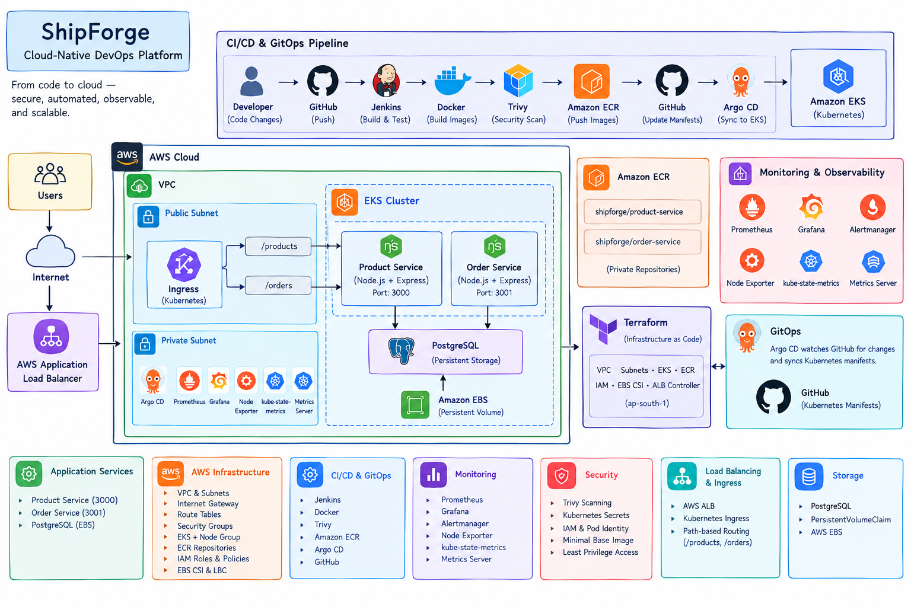
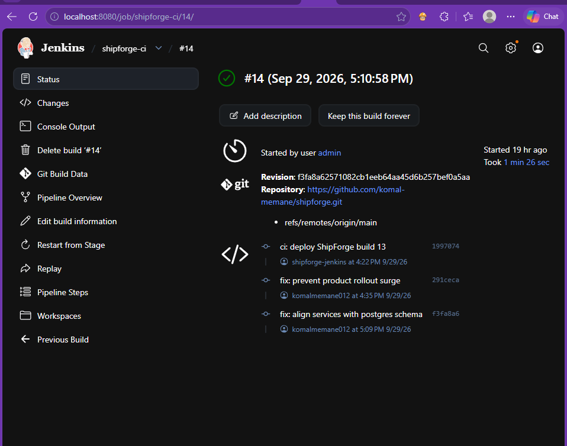
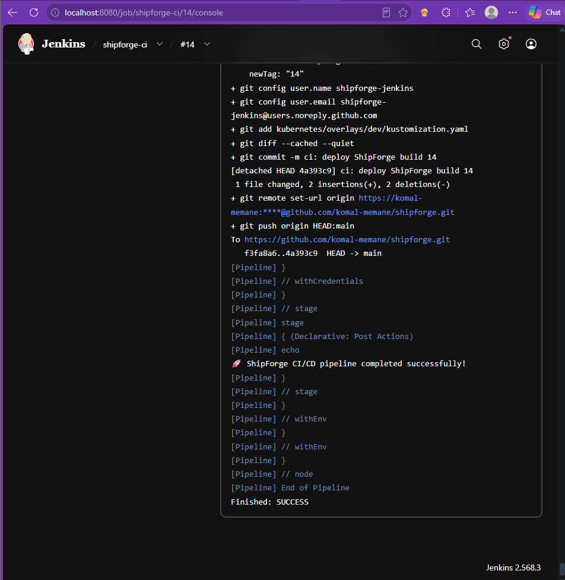
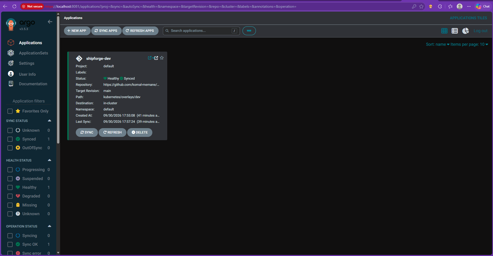
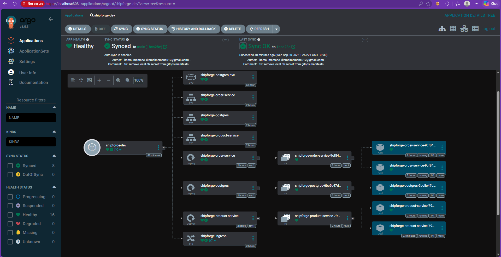
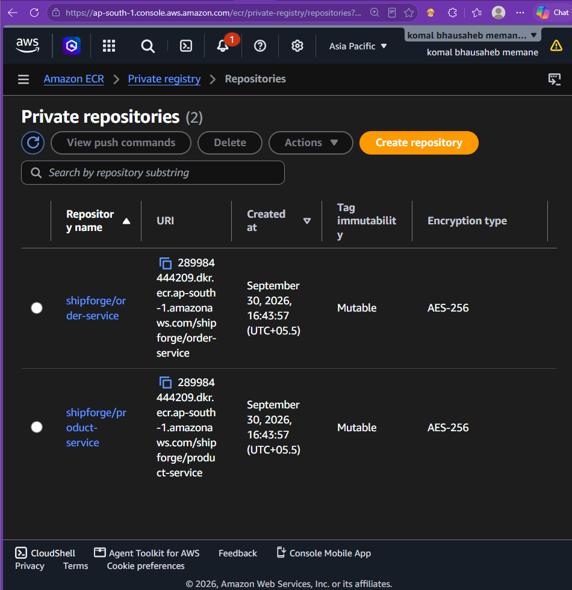
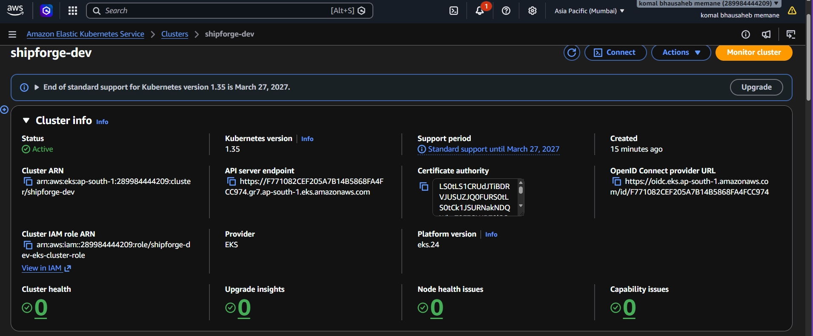
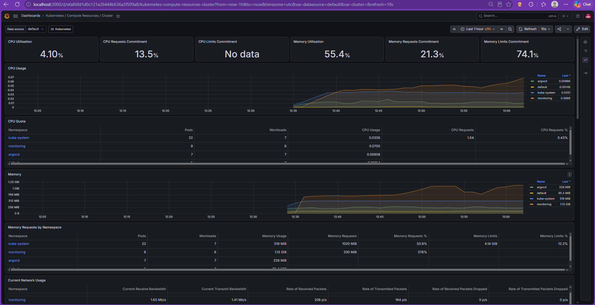
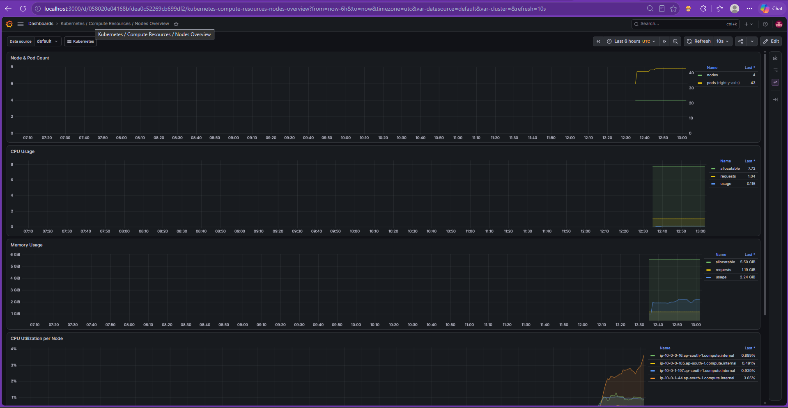
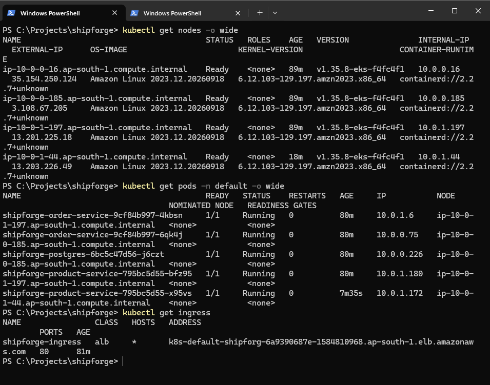

# ShipForge

**A cloud-native DevOps platform on AWS: Terraform, Jenkins CI/CD, GitOps with Argo CD, Amazon EKS and Prometheus/Grafana monitoring.**

ShipForge is a small microservices application built to show a complete DevOps workflow, from a `git push` to a monitored Kubernetes deployment on AWS.



---

## Table of Contents

- [Highlights](#highlights)
- [Architecture](#architecture)
- [Tech Stack](#tech-stack)
- [Services](#services)
- [CI/CD Pipeline](#cicd-pipeline)
- [GitOps with Argo CD](#gitops-with-argo-cd)
- [AWS Infrastructure (Terraform)](#aws-infrastructure-terraform)
- [Kubernetes](#kubernetes)
- [Ingress and Load Balancing](#ingress-and-load-balancing)
- [Security](#security)
- [Monitoring and Observability](#monitoring-and-observability)
- [Health Checks and Testing](#health-checks-and-testing)
- [Deployment Strategy](#deployment-strategy)
- [Screenshots](#screenshots)
- [Repository Structure](#repository-structure)
- [Getting Started](#getting-started)
- [Cost Note](#cost-note)
- [Limitations and Next Steps](#limitations-and-next-steps)
- [Author](#author)

---

## Highlights

- **Infrastructure as Code:** VPC, EKS, ECR, IAM and the AWS Load Balancer Controller are provisioned with Terraform.
- **Automated CI:** Jenkins installs dependencies, runs tests, builds Docker images, scans them with Trivy and pushes them to Amazon ECR.
- **GitOps delivery:** Jenkins commits the new image tag to Git and Argo CD syncs the change to the cluster.
- **Kubernetes on EKS:** two Node.js microservices and PostgreSQL, managed with Kustomize.
- **Public access through an ALB:** an AWS Application Load Balancer routes `/products` and `/orders` through a Kubernetes Ingress.
- **Observability:** Prometheus, Grafana, Alertmanager, Node Exporter and kube-state-metrics.

---

## Architecture

```
Developer
    |
    | git push
    v
GitHub
    |
    v
Jenkins CI/CD
    |
    +--> Tests
    +--> Docker Build
    +--> Trivy Security Scan
    |
    v
Amazon ECR
    |
    v
GitOps Manifest Update
    |
    v
GitHub
    |
    v
Argo CD
    |
    v
Amazon EKS
    |
    +-------------------+
    |                   |
    v                   v
Product Service     Order Service
    |                   |
    +---------+---------+
              |
              v
         PostgreSQL
              |
              v
          EBS Volume

Users
  |
  v
AWS Application Load Balancer
  |
  v
Kubernetes Ingress
  |
  +---- /products ----> Product Service
  |
  +---- /orders ------> Order Service
```

---

## Tech Stack

| Area                     | Technology                    |
| ------------------------ | ----------------------------- |
| Application              | Node.js, Express.js           |
| Database                 | PostgreSQL                    |
| Containers               | Docker                        |
| Container Registry       | Amazon ECR                    |
| Cloud                    | AWS (`ap-south-1`)            |
| Kubernetes               | Amazon EKS                    |
| Infrastructure as Code   | Terraform                     |
| Kubernetes Configuration | Kustomize                     |
| CI/CD                    | Jenkins                       |
| GitOps                   | Argo CD                       |
| Load Balancing           | AWS Application Load Balancer |
| Security Scanning        | Trivy                         |
| Monitoring               | Prometheus, Grafana           |
| Cluster Metrics          | Kubernetes Metrics Server     |
| Source Control           | GitHub                        |

---

## Services

### Product Service

Node.js/Express microservice for product data. Runs on port `3000`.

| Method | Endpoint    | Description  |
| ------ | ----------- | ------------ |
| GET    | `/`         | Service info |
| GET    | `/health`   | Health check |
| GET    | `/products` | List products |

### Order Service

Node.js/Express microservice for order data. Runs on port `3001`.

| Method | Endpoint  | Description  |
| ------ | --------- | ------------ |
| GET    | `/`       | Service info |
| GET    | `/health` | Health check |
| GET    | `/orders` | List orders  |
| POST   | `/orders` | Create an order |

### PostgreSQL

Provides persistent storage for the services. It runs inside Kubernetes using a Deployment, a ClusterIP Service, a PersistentVolumeClaim and AWS EBS storage.

---

## CI/CD Pipeline

Every application change goes through the Jenkins pipeline defined in the [`Jenkinsfile`](Jenkinsfile).

```
Git Push
   |
   v
Jenkins
   |
   +--> Install dependencies
   +--> Run tests
   +--> Build Docker images
   +--> Trivy vulnerability scan
   +--> Push images to Amazon ECR
   +--> Update Kustomize image tags
   +--> Commit GitOps change
   +--> Push to GitHub
   |
   v
Argo CD
   |
   +--> Detect Git change
   +--> Synchronize Kubernetes manifests
   |
   v
Amazon EKS
```

- Images are tagged with the **Jenkins build number**, so every release can be traced to a build.
- A failed test or a failed security scan stops the pipeline before anything is pushed or deployed.

---

## GitOps with Argo CD

Argo CD watches this repository and keeps the cluster in sync with the Kubernetes manifests in Git.

- Argo CD project and application definitions are in [`argocd/`](argocd).
- The development overlay is in `kubernetes/overlays/dev/`.
- Kustomize manages the ECR image names and tags, and Jenkins updates them on each successful build.

---

## AWS Infrastructure (Terraform)

Terraform in [`terraform/`](terraform) manages:

- Amazon VPC with public and private subnets
- Internet Gateway and route tables
- Security groups
- Amazon EKS cluster and managed node group
- Amazon ECR repositories
- IAM roles and policies
- EBS CSI driver integration
- AWS Load Balancer Controller

Region: `ap-south-1`

---

## Kubernetes

The cluster runs:

- Product Service
- Order Service
- PostgreSQL
- Argo CD
- AWS Load Balancer Controller
- Metrics Server
- Prometheus, Grafana, Node Exporter and kube-state-metrics

Manifests are organized with Kustomize:

```
kubernetes/
├── base/
│   ├── product-service/
│   ├── order-service/
│   ├── postgres/
│   └── ingress.yaml
└── overlays/
    └── dev/
        └── kustomization.yaml
```

The `base` folder holds reusable resources and the `dev` overlay holds environment-specific settings.

Two private ECR repositories store the images:

```
shipforge/product-service
shipforge/order-service
```

---

## Ingress and Load Balancing

The AWS Load Balancer Controller creates an Application Load Balancer from the Kubernetes Ingress resource.

| Path        | Target          | Port   |
| ----------- | --------------- | ------ |
| `/products` | Product Service | `3000` |
| `/orders`   | Order Service   | `3001` |

The services themselves stay as internal `ClusterIP` services.

---

## Security

**Container security**
- Trivy scans images for `HIGH` and `CRITICAL` vulnerabilities before they are pushed to ECR.
- The containers use the `node:24-alpine` base image.
- Unneeded npm and Corepack components are removed from the final runtime image.

**Secrets**
- Database credentials are not hardcoded in the application source code.
- Kubernetes Secrets pass database configuration to the pods.

**IAM**
- Dedicated IAM roles are used for EKS, the worker nodes, the EBS CSI driver and the AWS Load Balancer Controller.
- EKS Pod Identity is used where appropriate.

---

## Monitoring and Observability

Prometheus and Grafana monitor the cluster. The monitoring stack includes Prometheus, Grafana, Alertmanager, Node Exporter, kube-state-metrics and the Kubernetes Metrics Server.

Grafana shows:

- Node CPU and memory usage
- Pod counts
- Kubernetes resources
- Container activity
- Overall cluster metrics

---

## Health Checks and Testing

Both services expose `GET /health`, which Kubernetes uses for liveness and readiness probes.

```json
{
  "status": "healthy"
}
```

Tests currently cover the health endpoints of both services and run with `npm test`. Jenkins runs them before building any image.

---

## Deployment Strategy

ShipForge uses Kubernetes rolling updates, with rollout settings sized for the capacity of the development EKS cluster. Readiness and liveness probes keep the app available while pods are replaced.

```
New Image -> Amazon ECR -> GitOps Tag Update -> Argo CD Sync -> Rolling Update -> New Pods
```

---

## Screenshots

### Jenkins CI/CD

| Jenkins pipeline | Jenkins pipeline run |
| --- | --- |
|  |  |

### Argo CD (GitOps)

| Argo CD | Argo CD application |
| --- | --- |
|  |  |

### Amazon ECR and EKS

| Amazon ECR repositories | EKS cluster |
| --- | --- |
|  |  |

### Monitoring and kubectl

| Grafana | Grafana dashboard |
| --- | --- |
|  |  |

| kubectl output |
| --- |
|  |

---

## Repository Structure

```
shipforge/
├── application/
│   ├── product-service/
│   └── order-service/
├── architecture/
├── argocd/
│   ├── application.yaml
│   └── project.yaml
├── jenkins/
├── kubernetes/
│   ├── base/
│   └── overlays/
│       └── dev/
├── screenshots/
├── terraform/
│   ├── provider.tf
│   ├── variables.tf
│   ├── vpc.tf
│   ├── eks.tf
│   ├── ecr.tf
│   ├── lbc.tf
│   └── outputs.tf
├── Jenkinsfile
└── README.md
```

---

## Getting Started

### Prerequisites

Node.js, npm, Docker, Git, AWS CLI, Terraform, kubectl and Helm.

### Clone

```bash
git clone https://github.com/komal-memane/shipforge.git
cd shipforge
```

### Run a service locally

```bash
cd application/product-service   # or application/order-service
npm install
npm test
npm start
```

### Build and run with Docker

```bash
docker build -t shipforge-product-service:local application/product-service
docker build -t shipforge-order-service:local application/order-service

docker run --rm -p 3000:3000 shipforge-product-service:local
docker run --rm -p 3001:3001 shipforge-order-service:local
```

### Provision the AWS infrastructure

```bash
cd terraform
terraform init
terraform plan
terraform apply
```

### Render the Kubernetes manifests

```bash
kubectl kustomize kubernetes/overlays/dev
```

The actual deployment to EKS is handled by Argo CD, which reads `argocd/project.yaml` and `argocd/application.yaml`.

### Tear everything down

```bash
cd terraform
terraform destroy
```

---

## Cost Note

EKS, the node group, the load balancer and EBS volumes all cost money while they run. This project is meant to be created, tested and destroyed. Run `terraform destroy` when you are done, and check that no load balancers or EBS volumes are left behind.

---

## Limitations

This is a learning project built to practice the full delivery workflow, so some things are deliberately simple:

---
